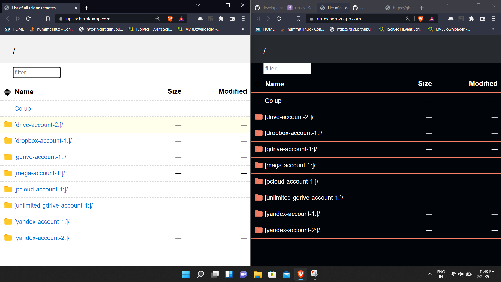

# HEROKU-RCLONE-SERVE-INDEX

Any Remote Cloud Index via HEROKU

Heroku oneclick / Rapid deploy method available

###### Star my Repository & Support me

 Feel free to post Any [Issues](https://github.com/developeranaz/RCLONE-SERVE-INDEX) And share your ideas , Posting issues would help to improve this repo

## How To Deploy ?
### Step 1
* Star my repository
* Create a [Heroku](https://dashboard.heroku.com/login) Free account
* Log in to Heroku in any browser
* Click on the Rapid deployment button  and deploy app
### Step 2 (setting Config Vars)
#### CONFIG_IN_URL

* Generate rclone.conf file from any terminal or cmd or termux .
* You can use Multiple cloud drive accounts in single rclone.conf file
* We need any text/code hosting website, Use [gist-github](https://gist.github.com) github account needed.
* Open rclone.config file using any text editors and copy all text inside rclone.conf and paste it in gist
* Choose any file name and save it.
* Then Click RAW button and copy the url
* Paste your config Url in the heroku 'CONFIG_IN_URL' Section

** note : Don't share this url to anyone

------------
### Features

* Drive ,Mega ,Onedrive and other remotes available.
* MEGA support is available at version 2.0
* No internet speed capping ,Enjoy Maximum download speed
* 24x7 permanent link
* No download limit or quota limit
* pause download available (Use download Managers like ADM ,XDM, Aria2 for more stability)

## Storage providers

  * 1Fichier [:page_facing_up:](https://rclone.org/fichier/)
  * Alibaba Cloud (Aliyun) Object Storage System (OSS) [:page_facing_up:](https://rclone.org/s3/#alibaba-oss)
  * Amazon Drive [:page_facing_up:](https://rclone.org/amazonclouddrive/) ([See note](https://rclone.org/amazonclouddrive/#status))
  * Amazon S3 [:page_facing_up:](https://rclone.org/s3/)
  * Backblaze B2 [:page_facing_up:](https://rclone.org/b2/)
  * Box [:page_facing_up:](https://rclone.org/box/)
  * Ceph [:page_facing_up:](https://rclone.org/s3/#ceph)
  * Citrix ShareFile [:page_facing_up:](https://rclone.org/sharefile/)
  * DigitalOcean Spaces [:page_facing_up:](https://rclone.org/s3/#digitalocean-spaces)
  * Dreamhost [:page_facing_up:](https://rclone.org/s3/#dreamhost)
  * Dropbox [:page_facing_up:](https://rclone.org/dropbox/)
  * Enterprise File Fabric [:page_facing_up:](https://rclone.org/filefabric/)
  * FTP [:page_facing_up:](https://rclone.org/ftp/)
  * GetSky [:page_facing_up:](https://rclone.org/jottacloud/)
  * Google Cloud Storage [:page_facing_up:](https://rclone.org/googlecloudstorage/)
  * Google Drive [:page_facing_up:](https://rclone.org/drive/)
  * Google Photos [:page_facing_up:](https://rclone.org/googlephotos/)
  * HDFS (Hadoop Distributed Filesystem) [:page_facing_up:](https://rclone.org/hdfs/)
  * HTTP [:page_facing_up:](https://rclone.org/http/)
  * Hubic [:page_facing_up:](https://rclone.org/hubic/)
  * Jottacloud [:page_facing_up:](https://rclone.org/jottacloud/)
  * IBM COS S3 [:page_facing_up:](https://rclone.org/s3/#ibm-cos-s3)
  * Koofr [:page_facing_up:](https://rclone.org/koofr/)
  * Mail.ru Cloud [:page_facing_up:](https://rclone.org/mailru/)
  * Memset Memstore [:page_facing_up:](https://rclone.org/swift/)
  * Mega [:page_facing_up:](https://rclone.org/mega/)
  * Memory [:page_facing_up:](https://rclone.org/memory/)
  * Microsoft Azure Blob Storage [:page_facing_up:](https://rclone.org/azureblob/)
  * Microsoft OneDrive [:page_facing_up:](https://rclone.org/onedrive/)
  * Minio [:page_facing_up:](https://rclone.org/s3/#minio)
  * Nextcloud [:page_facing_up:](https://rclone.org/webdav/#nextcloud)
  * OVH [:page_facing_up:](https://rclone.org/swift/)
  * <del>OpenDrive</del> [:page_facing_up:](https://rclone.org/opendrive/)
  * OpenStack Swift [:page_facing_up:](https://rclone.org/swift/)
  * Oracle Cloud Storage [:page_facing_up:](https://rclone.org/swift/)
  * ownCloud [:page_facing_up:](https://rclone.org/webdav/#owncloud)
  * pCloud [:page_facing_up:](https://rclone.org/pcloud/)
  * premiumize.me [:page_facing_up:](https://rclone.org/premiumizeme/)
  * put.io [:page_facing_up:](https://rclone.org/putio/)
  * QingStor [:page_facing_up:](https://rclone.org/qingstor/)
  * Rackspace Cloud Files [:page_facing_up:](https://rclone.org/swift/)
  * Scaleway [:page_facing_up:](https://rclone.org/s3/#scaleway)
  * Seafile [:page_facing_up:](https://rclone.org/seafile/)
  * SFTP [:page_facing_up:](https://rclone.org/sftp/)
  * StackPath [:page_facing_up:](https://rclone.org/s3/#stackpath)
  * SugarSync [:page_facing_up:](https://rclone.org/sugarsync/)
  * Tardigrade [:page_facing_up:](https://rclone.org/tardigrade/)
  * Tencent Cloud Object Storage (COS) [:page_facing_up:](https://rclone.org/s3/#tencent-cos)
  * Wasabi [:page_facing_up:](https://rclone.org/s3/#wasabi)
  * WebDAV [:page_facing_up:](https://rclone.org/webdav/)
  * Yandex Disk [:page_facing_up:](https://rclone.org/yandex/)
  * Zoho WorkDrive [:page_facing_up:](https://rclone.org/zoho/)

## What's New
* More cloud support available.
* Config Fused to heroku deployment section.
* No need to expose your rclone.conf file
* No need to add CLOUDNAME.
* Multi cloud index 🤩 All cloud/remotes in single index like teamdrive seperated as folder. --⭐ newly added
* Encryption Username & Password --⭐ newly added
* Better Dark UI --⭐ newly added
